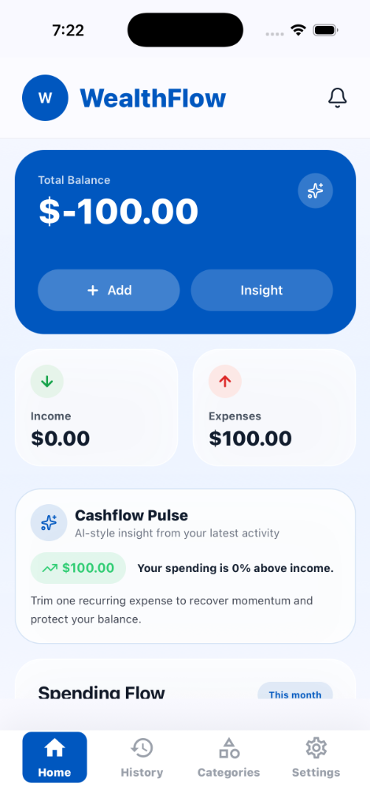
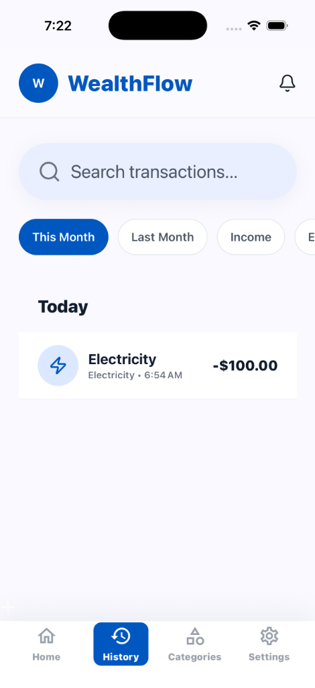
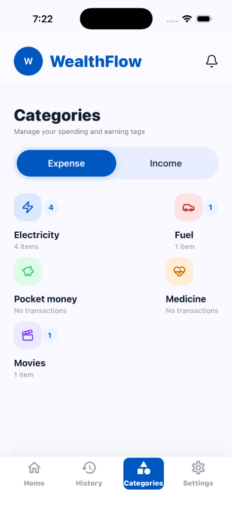
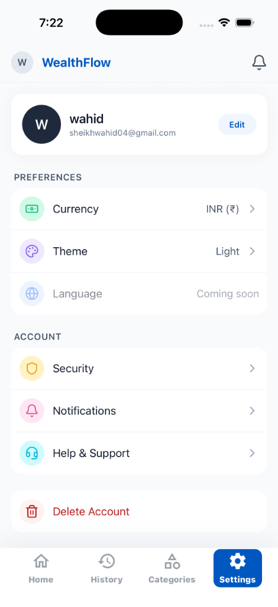

# WealthFlow 💸

WealthFlow is a modern, production-ready personal finance tracker built with **React Native (Expo)** and **Firebase**. Keep track of your income and expenses seamlessly with an intuitive, fluid user interface designed for speed and clarity.

## 📸 Screenshots

<div align="center">
  
  
  
  
</div>

## ✨ Features

- **Intuitive Dashboard:** Get a quick AI-style pulse on your cashflow and see your total balance instantly.
- **Transaction History:** Scroll through your past income and expenses with month-based filtering.
- **Custom Categories:** Manage and customize spending and earning tags with a clean visual grid and badged indicators.
- **Secure Authentication:** User accounts managed via Firebase Authentication.
- **Realtime Sync:** Uses Firebase Realtime Database for blazingly fast data syncing across devices.
- **Modular Architecture:** Organized perfectly using a feature-driven design pattern for easy maintainability.

## 🛠️ Technology Stack

- **Framework:** [Expo](https://expo.dev/) (v54) / React Native (v0.81.5)
- **Navigation:** Expo Router (File-based routing)
- **Database:** Firebase Realtime Database
- **Auth:** Firebase Authentication
- **Styling:** NativeWind & StyleSheet
- **Forms/Validation:** Zod

## 🚀 Getting Started

### Prerequisites
- Node.js (v18 or higher)
- Expo CLI
- iOS Simulator or Android Emulator (or a physical device with Expo Go)

### Installation

1. **Clone the repository:**
   ```bash
   git clone https://github.com/AbdulWaihd/MoneyManager.git
   cd MoneyManager
   ```

2. **Install dependencies:**
   ```bash
   npm install
   ```

3. **Environment Setup:**
   Create a `.env` file in the root directory and add your Firebase credentials:
   ```env
   EXPO_PUBLIC_FIREBASE_API_KEY=your_api_key
   EXPO_PUBLIC_FIREBASE_AUTH_DOMAIN=your_auth_domain
   EXPO_PUBLIC_FIREBASE_DATABASE_URL=your_db_url
   EXPO_PUBLIC_FIREBASE_PROJECT_ID=your_project_id
   EXPO_PUBLIC_FIREBASE_STORAGE_BUCKET=your_storage_bucket
   EXPO_PUBLIC_FIREBASE_MESSAGING_SENDER_ID=your_sender_id
   EXPO_PUBLIC_FIREBASE_APP_ID=your_app_id
   EXPO_PUBLIC_FIREBASE_MEASUREMENT_ID=your_measurement_id
   ```

4. **Run the app:**
   ```bash
   npx expo start --clear
   ```
   Press `i` to open in iOS simulator, or `a` to open in Android emulator.

## 📁 Project Structure

```
src/
├── app/                  # Expo Router navigation (Auth & Tabs)
├── components/           # Shared UI components (Buttons, Inputs, Modals)
├── constants/            # Theme, Colors, Typography, Spacing
├── contexts/             # Global Context providers (Auth, Loading)
├── hooks/                # Custom React Hooks (e.g., useForm)
├── modules/              # Feature-based modules
│   ├── auth/             # Authentication logic & screens
│   ├── category/         # Categories logic & screens
│   ├── settings/         # User preferences & account management
│   ├── transaction/      # Income/Expense logic & screens
│   └── user/             # User data logic
└── utils/                # Helper functions
```

## 🔐 Security Notes
This project requires Firebase Security Rules to protect user data. Ensure that rules are deployed allowing users to only read/write their own transaction and category records.

---
*Built by AbdulWaihd*
